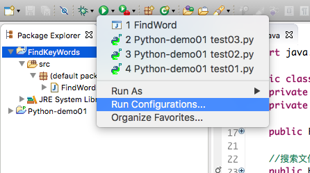
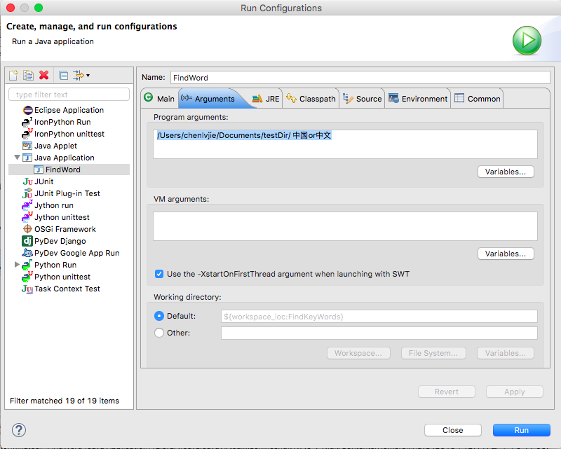

# FindKeyWords

## What's this about
This is a simple JAVA program that retrieve specific key word's segments under a directory.

## How to run this program
Since the key string and the path of directory is designed to be input in command line. So You have two ways to run this program.

### 1. Run in Eclipse
* Open the source file `src/FindWord.java` by Eclipse.
* Click here to configure the run configuration.   

* Input the string as follows.

Previous part is the path of directory. The following part is the key string. Two parameters should be seperated by at least one space.
* Click 'Apply' and run.

### 2. Run in command line
* Open command line.   
If you use Windows. Press Window+R, input 'cmd' then return. If you use Mac OS, you can find comman line under `Else` directory in launchpad view.

* Go to the path of this project. (assume the path where you put this project is [path])   
If you use Windows, input this command: 
	
		cd [path]\FindKeyWords\\\bin\\
If you use Mac OS, input this command: 

		cd [path]/FindKeyWords/bin/

* Run this program   
Input this command: 
	
		java FindWord [path of directory] [key string]   
You should replace **[path of directory]** and **[key string]** into what you really want to use.

## About the code
This is just a simple program. I use IO class and regular expression to accomplish the tasks. If you have any doubt, please feel free to ask me.

#### Contact
Email: jimchen0605@qq.com 
